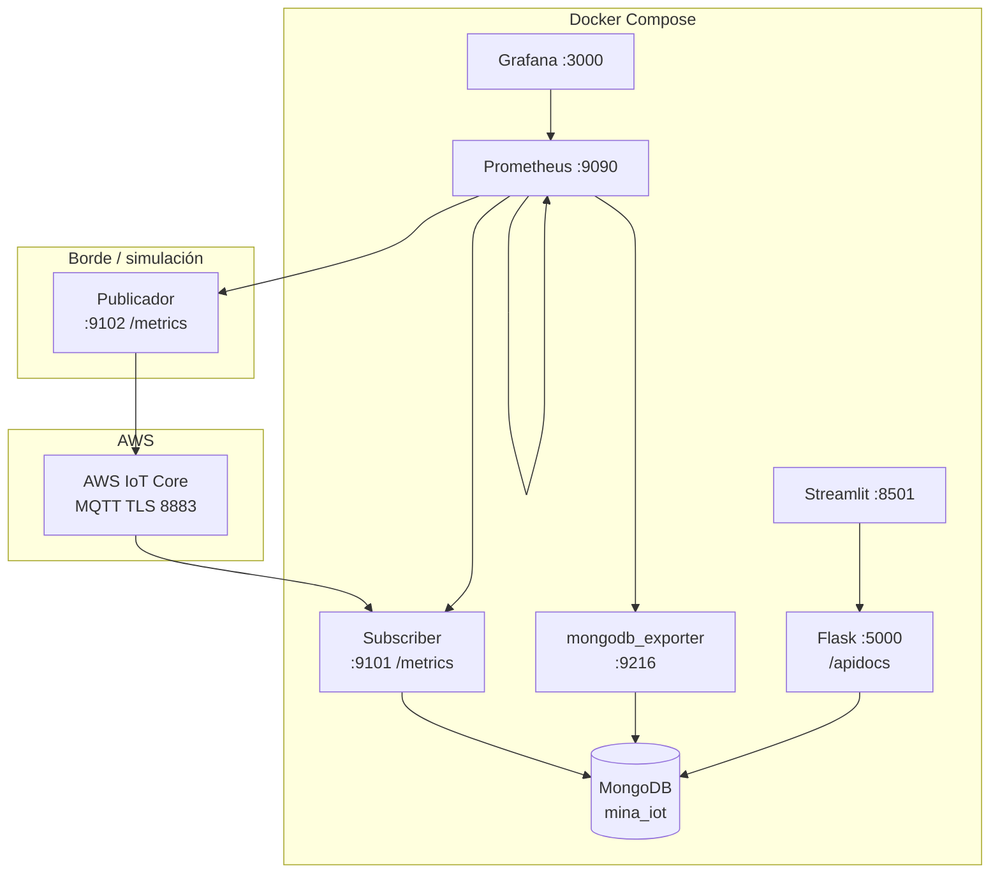

# Justificación de decisiones arquitectónicas — Hito 2 MQTT (mina, sector norte)

Proyecto orientado a la evaluación sumativa **«Sistema IoT para monitoreo de extracción minera»**, focalizado en la zona **sector_norte_Fuenzalida_Vallejos**, con las tecnologías obligatorias: **AWS IoT Core (MQTT)**, **MongoDB**, **Flask (REST)**, **Streamlit** y **Docker**.

**Fidelidad al PDF:** la consigna exige usar **solo** el broker configurado en **AWS IoT Core** y **no** crear un broker MQTT alternativo. Por tanto **no se usa Mosquitto** (ni otro broker local en Docker/puerto 1883): el único broker es el **servicio gestionado en AWS**.

## 1. Visión general de la arquitectura

El sistema sigue un patrón **orientado a eventos / publicar–suscribir** entre borde simulado y núcleo de procesamiento:

1. **Publicadores** (contenedores Python + PAHO) generan telemetría de producción, química y seguridad y la envían al **broker único** **AWS IoT Core** mediante MQTT sobre TLS (puerto 8883). Cada payload incluye **`published_at`** (UTC) para medir latencia de punta a punta hasta el subscriber.
2. El **subscriber** se suscribe con un wildcard jerárquico al prefijo del sector y persiste cada mensaje válido en **MongoDB** con marca temporal **UTC** (`timestamp` al persistir). Expone métricas **Prometheus** en `:9101`.
3. **Flask** expone la colección mediante **REST** (solo lectura para el dashboard), con documentación interactiva **Swagger** en `/apidocs/`, filtrando por categoría y tipo de sensor.
4. **Streamlit** consume el API, aplica filtros en la UI y muestra tablas y **gráficos de tendencia** (Plotly), con actualización **cuasi en tiempo real** (auto-refresh).
5. **Prometheus** recolecta series temporales del subscriber, del publicador (`:9102`), del **mongodb_exporter** (`:9216`) y de sí mismo; **Grafana** (`:3000`) visualiza un dashboard provisionado con **latencia de transmisión**, **frecuencia de publicación/ingesta** y un panel de **mensajes MQTT ignorados** (filtro por sector). El **tamaño de datos en MongoDB** sigue estando disponible en Prometheus vía el exporter (`mongodb_dbstats_data_size_bytes`) o con **mongosh**, aunque no forma parte de ese dashboard por defecto.
6. **Docker Compose** orquesta MongoDB, subscriber, API, frontend, publicador, Prometheus, Grafana y el exporter para un despliegue reproducible.

Esta separación desacopla el **ritmo de publicación MQTT** del **consumo HTTP** del operador: los sensores no conocen al dashboard; el dashboard no bloquea la ingesta. La capa de observabilidad mide el sistema sin formar parte del camino crítico MQTT→MongoDB→REST.

## 2. Decisiones clave y su motivación

### 2.1 Topics MQTT jerárquicos (`mina/<sector>/<categoría>/<métrica>`)

**Decisión:** Usar una convención alineada con la consigna del PDF (`mina/zona_norte/...`), sustituyendo la zona por el identificador de **sector** **sector_norte_Fuenzalida_Vallejos**.

**Por qué:**

- Refleja la **estructura física/operativa** (mina → sector → familia de variables → métrica).
- Permite **wildcard** del suscriptor (`mina/sector_norte_Fuenzalida_Vallejos/#`) sin mezclar otras zonas si en el futuro se agregan más sectores en el mismo broker.
- Facilita **políticas IAM / autorización** en AWS IoT Core por prefijo de topic.

**Importante:** Si las políticas del certificado en AWS IoT Core estaban limitadas a otro prefijo (por ejemplo `campo/#`), debe actualizarse la política para permitir `mina/*` o el prefijo concreto del sector; si no, los clientes recibirán error de autorización.

### 2.2 QoS 1 en publicación y suscripción

**Decisión:** Publicar y suscribir con **QoS 1** (al menos una entrega).

**Por qué:**

- En entorno industrial/minero interesa **no perder lecturas** por cortes breves de red.
- QoS 1 ofrece un equilibrio razonable entre **confiabilidad** y **coste de mensajes** respecto a QoS 2 (exactamente una vez, más conversación en el protocolo).
- QoS 0 habría sido aceptable solo para métricas puramente “best effort”; la consigna y la rúbrica valoran la **justificación del QoS**, por eso se privilegió 1.

### 2.3 MongoDB (NoSQL, documentos)

**Decisión:** Base **mina_iot**, colección **lecturas**, un documento por evento con campos como `sector`, `categoria`, `sensor`, `valor`, `unidad`, `timestamp`, `topic_mqtt`.

**Por qué:**

- El dominio es **alta frecuencia de escrituras** con esquema relativamente uniforme pero evolutivo (nuevas métricas o unidades): los documentos JSON encajan naturalmente.
- Permite **historizar** sin migraciones rígidas propias de tablas relacionales.
- Consultas por sector/categoría/sensor con índices simples (para producción se recomendaría crear índices compuestos sobre `sector`, `timestamp`, etc.).

### 2.4 Flask como capa REST entre MongoDB y Streamlit

**Decisión:** El dashboard **no** accede directamente a MongoDB.

**Por qué:**

- **Separación de responsabilidades:** Streamlit se centra en visualización; el API centraliza reglas de filtrado y límites (`limit`, `order`).
- **Seguridad y despliegue:** En un entorno real, expondrías autenticación y rate limiting en el API, no en el notebook/dashboard.
- La consigna pide explícitamente un **backend Flask** para el frontend Streamlit.

### 2.5 Streamlit local (en contenedor) y actualización cuasi en tiempo real

**Decisión:** Auto-refresh periódico (p. ej. 8 s) en lugar de WebSockets MQTT en el navegador.

**Por qué:**

- Cumple el requisito de **visualización local** y simplifica la demo académica.
- **MQTT en el browser** implicaría WebSockets + autenticación distinta o bridge; no es obligatorio en la consigna y añade complejidad.
- El retardo aceptado es **cuasi tiempo real**, adecuado para supervisión gerencial de tendencias.

### 2.6 Contenedores Docker

**Decisión:** Un servicio por rol (ingesta, DB, API, UI, publicador, observabilidad).

**Por qué:**

- Reproducibilidad para corrección y presentación oral.
- Escalar horizontalmente publicadores o réplicas del subscriber en escenarios mayores (con cuidado de **IDs de cliente MQTT únicos** y políticas AWS).

### 2.7 Observabilidad (Prometheus + Grafana)

**Decisión:** **Prometheus** hace *scrape* periódico de endpoints `/metrics` (formato estándar); **Grafana** consume Prometheus como *datasource* y el dashboard versionado en el repositorio muestra **latencia** (`mina_mqtt_ingest_latency_seconds`), **tasas** de mensajes publicados/recibidos y el contador de **mensajes ignorados por sector**. El **mongodb_exporter** aporta series sobre MongoDB (p. ej. tamaño de datos) **disponibles en Prometheus** para consultas o paneles adicionales.

**Por qué:**

- Las métricas técnicas de la rúbrica (latencia, frecuencia, volumen almacenado) quedan **verificables** con PromQL, Grafana y, para volumen, también **mongosh** o el exporter, sin acoplar la instrumentación al frontend Streamlit.
- Prometheus y Grafana son el par habitual **recolectar / visualizar**; no sustituyen al broker ni a MongoDB.

### 2.8 Documentación de API (Flask + Flasgger)

**Decisión:** Integrar **Flasgger** en Flask para generar **Swagger UI** (`/apidocs/`) y especificación OpenAPI 2.0, sin alterar el comportamiento de `/health`, `/logs` ni `/meta`.

**Por qué:**

- Facilita pruebas manuales y la defensa oral del contrato REST; la validación de peticiones entrantes no se activa para no cambiar el comportamiento de los clientes existentes.

## 3. Métricas estimadas (para exposición oral)

| Concepto | Estimación orientativa |
|----------|-------------------------|
| Frecuencia del publicador | Una ronda completa de métricas (~9 publicaciones) cada ~13 s → orden de **0,5–0,7 eventos/s** en conjunto |
| Latencia publicador → suscriptor | Típicamente **100 ms–1 s** en Internet hogar/lab; **medición objetiva** en Grafana/Prometheus: percentiles sobre `mina_mqtt_ingest_latency_seconds` (tiempo entre `published_at` y recepción en el subscriber) |
| Volumen en MongoDB | Con un publicador por zona activo, órdenes de **decenas de miles de documentos/día** si se dejara 24 h; en demo de minutos, bastante menor; **tamaño en bytes** consultable vía métricas `mongodb_dbstats_data_size_bytes` o `mongosh` |

(Ajustar números midiendo en tu red durante la demo. Scripts de consulta en `monitoring/scripts/`.)

### Diagrama de alto nivel (actualizado)

## 4. Escalabilidad (cómo crecería el sistema)

- **Más zonas:** Nuevos prefijos `mina/<otro_sector>/...` y políticas AWS por prefijo; opcionalmente **varios subscribers** con partición por prefijo o **shard en MongoDB** por `sector`.
- **Mayor carga:** Cola intermediaria (p. ej. Kinesis, MSK) entre IoT Core y persistencia si el volumen supera la escritura directa a MongoDB.
- **Dashboard:** Cacheo en API, paginación, índices MongoDB, o sustitución de polling por **Server-Sent Events** si se requiere menor latencia.

## 5. Preguntas que podría hacer el profesor — y respuestas sugeridas

**P: ¿Por qué MQTT y no REST desde los sensores hacia el servidor?**  
**R:** MQTT está pensado para **telemetría continua**, **ancho de banda reducido** y redes **inestables**; el modelo pub/sub desacopla sensores de consumidores. REST implicaría **polling** o muchas conexiones HTTP concurrentes y mayor overhead por lectura.

**P: ¿Por qué QoS 1 y no 0 o 2?**  
**R:** QoS 0 no garantiza entrega; QoS 2 garantiza exactamente una vez pero con **más ida y vuelta** y coste. QoS 1 es el compromiso habitual para **telemetría que no puede perderse** pero tolera **duplicados raros** (manejables en ingesta idempotente).

**P: ¿Usan Mosquitto u otro broker en Docker? ¿Por qué no?**  
**R:** **No.** La consigna prohibe un broker alternativo al de **AWS IoT Core**. Mosquitto en local sería un segundo broker y no cumpliría el requisito. Todo el tráfico MQTT va al endpoint de AWS (**TLS 8883**, certificados del curso).

**P: ¿Cómo evitan que otro equipo o sector “contamine” nuestra base de datos si todos usan el mismo broker?**  
**R:** El subscriber solo persiste mensajes cuyo **`sector` en el payload** coincide con el **sector configurado** (alineado con el topic `mina/<sector>/...`). En producción se reforzaría con **certificados/políticas por dispositivo** y prefijos de topic aislados por cuenta o entorno.

**P: ¿Por qué Flask y no GraphQL / FastAPI?**  
**R:** La consigna pide Flask explícito y el dominio es **consultas simples** de lectura; FastAPI podría ser alternativa moderna, pero no aporta ventaja decisiva para este alcance.

**P: ¿El dashboard es tiempo real?**  
**R:** Es **cuasi tiempo real**: Streamlit **refresca** periódicamente vía REST; la ingesta MQTT sigue siendo en tiempo real hasta MongoDB. Para latencias sub-segundo en UI haría falta otro canal (WebSockets).

**P: ¿Qué pasa si MongoDB cae?**  
**R:** El subscriber debería implementar **cola local** o política de **backpressure**; en esta versión académica se prioriza simplicidad y se reconoce el riesgo de pérdida de mensajes si la DB está caída.

**P: ¿Cómo escalarían a 50 sectores?**  
**R:** Particionar topics, **índices** por `sector` y `timestamp`, posiblemente **múltiples instancias** de subscriber con **client ID** únicos y políticas AWS; valorar **TTL** en colecciones para archivar datos antiguos.

**P: ¿Por qué documentos planos y no una colección por tipo de sensor?**  
**R:** Un solo tipo de **evento de lectura** simplifica ingesta y consultas globales; las colecciones separadas optimizarían casos muy específicos pero complican el pipeline de ingesta.

---

*Documento orientado a la defensa oral del Hito 2; el código ejecutable y la demo en Docker complementan estas respuestas.*
